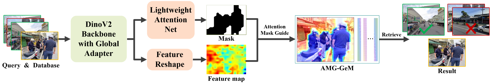

# HAM-VPR

This is the official repository for the paper "[High-Level Adaptive Feature Enhancement and Attention Mask-Guided Aggregation for Visual Place Recognition]()".



## Summary
**HAM-VPR** is an enhanced Visual Position Recognition (VPR) framework designed to improve robustness against challenges like dynamic occlusion and viewpoint variations. Key innovations include:  
 
1. **High-Level Adaptive Feature Enhancement**  
   - Integrates a lightweight `AdapterFormer` module into DINOv2's Transformer Block to enhance semantic adaptability while preserving fine-grained features.  
   - Reduces parameter redundancy and generates structured segmentation feature maps, bridging the gap between pre-trained models and VPR tasks.
2. **Attention Mask-Guided Aggregation**  
   - A lightweight attention module generates implicit masks to guide global feature aggregation, suppressing irrelevant regions and amplifying discriminative areas.  
   - Two-stage training ensures seamless fusion of mask and segmentation features without re-extracting base features.
3. **Dataset & Validation**  
   - Introduces the **VPR-City-Mask** dataset (derived from GSV-City) with region annotations for real-world mask validation.  
   - Achieves state-of-the-art performance on multiple VPR benchmarks, demonstrating scalability and robustness. 


## Dataset

The dataset should be organized in a directory tree as such:

```
├── datasets_vpr
    └── datasets
        └── VPR-City-Mask
            └── images
                └── train
                   ├── database
                   ├── database_mask
                   ├── queries
                   └── queries_mask
                └── val
                   ├── database
                   ├── database_mask
                   ├── queries
                   └── queries_mask
                └── test
                   ├── database
                   ├── database_mask
                   ├── queries
                   └── queries_mask
```


We used the pre-trained foundation model DINOv2 (ViT-L/14) ([HERE](https://dl.fbaipublicfiles.com/dinov2/dinov2_vitl14/dinov2_vitl14_pretrain.pth)) as the basis for fine-tuning training .


## Performance results of trained models
The model finetuned on VPR-City-Mask (for diverse scenes).
<table>
<thead>
  <tr>
    <th colspan="3">Pitts30k-test</th>
    <th colspan="3">Pitts250k-test</th>
    <th colspan="3">MSLS-val</th>
    <th colspan="3">Tokyo24/7</th>
    <th colspan="3">SF-XL-testv1</th>
  </tr>
  <tr>
    <th>R@1</th>
    <th>R@5</th>
    <th>R@10</th>
    <th>R@1</th>
    <th>R@5</th>
    <th>R@10</th>
    <th>R@1</th>
    <th>R@5</th>
    <th>R@10</th>
    <th>R@1</th>
    <th>R@5</th>
    <th>R@10</th>
    <th>R@1</th>
    <th>R@5</th>
    <th>R@10</th>
  </tr>
</thead>
<tbody>
  <tr>
    <td>89.7</td>
    <td>95.9</td>
    <td>96.6</td>
    <td>93.7</td>
    <td>98.2</td>
    <td>98.6</td>
    <td>83.6</td>
    <td>93.0</td>
    <td>95.0</td>
    <td>85.6</td>
    <td>92.2</td>
    <td>94.3</td>
    <td>76.9</td>
    <td>83.6</td>
    <td>80.5</td>
  </tr>
</tbody>
</table>

## Test
Set `rerank_num=100` to reproduce the results in paper, and set `rerank_num=20` to achieve a close result with only 1/5 re-ranking runtime (0.018s for a query).
```
python3 eval.py --datasets_folder=/path/to/your/datasets_vg/datasets --dataset_name=pitts30k --resume=./weight/HAM-VPR.pth
```

## Acknowledgements
Parts of this repo are inspired by the following repositories:

[DINOv2](https://github.com/facebookresearch/dinov2)

[SegFormer](https://github.com/NVlabs/SegFormer)

## Citation
If you find this repo useful for your research, please consider leaving a star⭐️ and citing the paper
```
@inproceedings{HAM-VPR,
  title={High-Level Adaptive Feature Enhancement and Attention Mask-Guided Aggregation for Visual Place Recognition},
  author={Wang Longhao, Lan Chaozhen, Wu Beibei, Yao Fushan, Wei Zijun, Gao Tian, Yu Hanyang},
  booktitle={***},
  year={2025}
}
```
